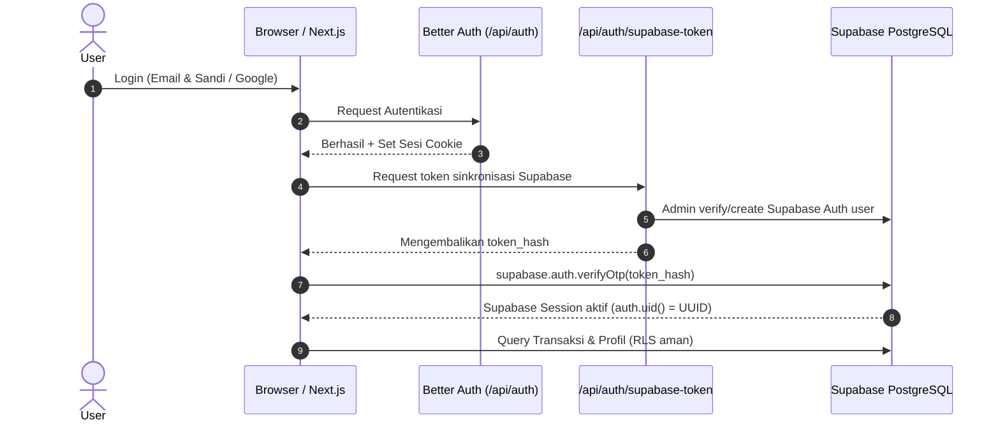

# FinanceRecord - Modern Personal Finance Management Platform

[](https://nextjs.org/)
[](https://react.dev/)
[](https://www.typescriptlang.org/)
[](https://tailwindcss.com/)
[](https://better-auth.com/)
[](https://supabase.com/)
[](LICENSE)

**FinanceRecord** adalah aplikasi web modern untuk manajemen keuangan pribadi dan pencatatan kas cerdas. Dirancang dengan tampilan antarmuka profesional, performa tinggi bertenaga Next.js App Router (Turbopack), autentikasi fleksibel (Better Auth & Google OAuth), sinkronisasi data real-time dengan Supabase PostgreSQL, serta perlindungan privasi data menggunakan Row Level Security (RLS).

---

## 📑 Daftar Isi

- [✨ Fitur Utama](#-fitur-utama)
- [🛠️ Tech Stack](#️-tech-stack)
- [🏗️ Arsitektur Sistem](#️-arsitektur-sistem)
  - [Struktur Direktori](#struktur-direktori)
  - [Alur Autentikasi & Sinkronisasi Sesi](#alur-autentikasi--sinkronisasi-sesi)
  - [Skema Basis Data](#skema-basis-data)
- [📋 Prasyarat Sistem](#-prasyarat-sistem)
- [🚀 Panduan Instalasi Lokal](#-panduan-instalasi-lokal)
  - [1. Clone Repository](#1-clone-repository)
  - [2. Install Dependencies](#2-install-dependencies)
  - [3. Konfigurasi Environment Variables](#3-konfigurasi-environment-variables)
  - [4. Migrasi Skema Basis Data](#4-migrasi-skema-basis-data)
  - [5. Jalankan Server Development](#5-jalankan-server-development)
- [🔐 Variabel Lingkungan (Environment Variables)](#-variabel-lingkungan-environment-variables)
- [📜 Script yang Tersedia](#-script-yang-tersedia)
- [🌐 Panduan Deployment (Vercel)](#-panduan-deployment-vercel)
- [🔍 Troubleshooting & Solusi](#-troubleshooting--solusi)
- [📄 Lisensi](#-lisensi)

---

## ✨ Fitur Utama

- **📊 Dashboard Interaktif & Analitik Lengkap**: Visualisasi kondisi finansial melalui grafik tren arus kas (Highcharts & Recharts), perbandingan pengeluaran vs pemasukan, serta distribusi kategori pengeluaran teratas.
- **💸 Manajemen Transaksi Real-time**: Catat transaksi harian, filter menurut periode/kategori/tipe, pencarian instan, dan pagination responsif.
- **🔄 Transaksi Berulang & Pengingat Otomatis (Recurring Schedules)**: Jadwalkan pengeluaran/pemasukan rutin (harian, mingguan, bulanan, tahunan) dengan fungsi deteksi jatuh tempo dan pembuatan entri transaksi otomatis sekali klik.
- **🎯 Target Tabungan (Financial Goals)**: Tetapkan target finansial, pantau akumulasi tabungan, persentase progres, dan estimasi waktu pencapaian.
- **💰 Anggaran Bulanan (Category Budgets)**: Tetapkan batas anggaran per kategori dan per bulan, lengkap dengan indikator progres dan peringatan overbudget.
- **🏷️ Kustomisasi Kategori Fleksibel**: Tambah atau hapus kategori kustom untuk pemasukan maupun pengeluaran langsung dari halaman pengaturan.
- **📤 Ekspor Laporan Finansial (CSV)**: Unduh ringkasan dan rincian transaksi dalam format CSV berdasarkan filter rentang tanggal.
- **🔒 Autentikasi Modern & Keamanan Berlapis**:
  - Dukungan autentikasi Email & Kata Sandi serta Google OAuth via Better Auth.
  - Sinkronisasi sesi otomatis ke Supabase Browser Client menggunakan token magic-link OTP.
  - Keamanan isolasi data per akun melalui Postgres Row Level Security (RLS).
- **🌗 Mode Terang & Gelap**: Desain antarmuka responsif dengan dukungan pergantian tema instan (*dark/light mode*).

---

## 🛠️ Tech Stack

| Layer | Teknologi |
| --- | --- |
| **Framework** | [Next.js 16.3.5](https://nextjs.org/) (App Router, Turbopack, React 19) |
| **Runtime & Package Manager** | [Bun](https://bun.sh/) / [Node.js](https://nodejs.org/) (v20+) |
| **Bahasa Pemrograman** | [TypeScript 5](https://www.typescriptlang.org/) |
| **Autentikasi** | [Better Auth 1.7](https://better-auth.com/) & Google OAuth |
| **Database & Penyimpanan** | [Supabase](https://supabase.com/) (PostgreSQL 15+ dengan Row Level Security) |
| **Koneksi Database Direct** | [pg (node-postgres)](https://node-postgres.com/) dengan Supabase Session Pooler |
| **Komponen UI & Styling** | [Tailwind CSS v4](https://tailwindcss.com/), [Radix UI](https://www.radix-ui.com/), [Lucide React](https://lucide.dev/) |
| **Grafik & Visualisasi Data** | [Highcharts](https://www.highcharts.com/), [Recharts](https://recharts.org/) |
| **Validasi Skema & Form** | [Zod](https://zod.dev/), [React Hook Form](https://react-hook-form.com/) |
| **Notifikasi Toast** | [Sonner](https://sonner.emilkowal.ski/) |

---

## 🏗️ Arsitektur Sistem

### Struktur Direktori

```text
next-finance-record/
├── src/
│   ├── app/                               # Next.js App Router
│   │   ├── (auth)/                        # Route grup autentikasi
│   │   │   ├── login/                     # Halaman Login (Email & Google)
│   │   │   ├── register/                  # Halaman Registrasi
│   │   │   ├── forgot-password/           # Reset Password
│   │   │   └── update-password/           # Update Password baru
│   │   ├── (dashboard)/                   # Halaman Dashboard terlindungi
│   │   │   ├── dashboard/
│   │   │   │   ├── add-transaction/       # Catat Transaksi Baru
│   │   │   │   ├── budgets-goals/         # Anggaran & Target Tabungan
│   │   │   │   ├── recurring/             # Transaksi Berulang & Pengingat
│   │   │   │   ├── settings/              # Profil, Kategori & Keamanan
│   │   │   │   └── transaction-lists/     # Rincian Seluruh Transaksi
│   │   │   └── layout.tsx                 # AppSidebar, Header, Breadcrumbs, UserMenu
│   │   ├── api/
│   │   │   ├── auth/[...all]/             # Better Auth API handler
│   │   │   ├── auth/supabase-token/       # Sinkronisasi sesi Better Auth ke Supabase
│   │   │   └── export/                    # Endpoint ekspor CSV transaksi & ringkasan
│   ├── components/                        # Komponen UI modular
│   │   ├── auth-component/                # Form login, register, reset password
│   │   ├── dashboard/                     # Widget, kartu statistik, form transaksi
│   │   │   ├── recurring/                 # Dialog & kartu transaksi berulang
│   │   │   ├── settings/                  # Tab Profile, Kategori, & Keamanan
│   │   │   └── transaction/               # Modal add transaction & kategori
│   │   ├── layout/                        # AppSidebar, Navbar, UserMenu
│   │   └── ui/                            # Shadcn/Radix primitive components
│   ├── hooks/                             # Custom React hooks (useAuth, useProfile, useTransactions, dll.)
│   ├── interfaces/                        # TypeScript types & interfaces
│   ├── lib/                               # Konfigurasi Better Auth (server & client)
│   ├── services/                          # Business logic & Database service layer
│   │   ├── analytics.service.ts           # Perhitungan metrik & ringkasan finansial
│   │   ├── budget.service.ts              # CRUD Anggaran bulanan
│   │   ├── category.service.ts            # Manajemen kategori default & kustom
│   │   ├── goal.service.ts                # CRUD Target tabungan
│   │   ├── profile.service.ts             # Manajemen profil & validasi username
│   │   ├── recurring.service.ts           # Eksekusi & jadwal transaksi rutin
│   │   └── transaction.service.ts         # CRUD Transaksi keuangan
│   ├── sql/                               # Skrip inisialisasi tabel SQL
│   └── utils/
│       ├── formatters.ts                  # Formatter mata uang IDR & tanggal
│       └── supabase/                      # Client browser, server & admin Supabase
├── supabase/
│   └── migrations/                        # File migrasi SQL Supabase
├── .env.example                           # Template variabel lingkungan
├── package.json                           # Metadata dependensi & script
└── tsconfig.json                          # Konfigurasi TypeScript
```

### Alur Autentikasi & Sinkronisasi Sesi

Aplikasi menggunakan pendekatan hybrid arsitektur autentikasi:

1. **User Login**: Pengguna melakukan autentikasi via Better Auth (Email/Password atau Google OAuth).
2. **Session Creation**: Better Auth membuat cookie sesi terenkripsi dan menyimpan catatan user ke tabel `"user"` PostgreSQL.
3. **Supabase Sync**:
   - Client hook `useAuth()` mendeteksi sesi Better Auth yang aktif.
   - Endpoint `/api/auth/supabase-token` memastikan user terdaftar di Supabase Auth dan membuat OTP magic link.
   - Browser client Supabase memverifikasi token (`supabase.auth.verifyOtp`) dan menetapkan sesi Supabase aktif.
4. **Row Level Security (RLS)**: Semua query data (`transactions`, `profiles`, `budgets`, `goals`, `recurring_schedules`) tervalidasi langsung oleh PostgreSQL via policy `auth.uid() = user_id`.



### Skema Basis Data

```text
profiles
├── id (UUID, PK → auth.users.id)
├── username (VARCHAR(50), UNIQUE)
├── full_name (TEXT)
├── avatar_url (TEXT)
└── created_at / updated_at (TIMESTAMPTZ)

transactions
├── id (UUID, PK)
├── user_id (UUID, FK → auth.users.id)
├── type (VARCHAR(10): 'income' | 'expense')
├── amount (DECIMAL(15,2))
├── description (TEXT)
├── category (VARCHAR(100))
├── date (DATE)
└── created_at / updated_at (TIMESTAMPTZ)

budgets
├── id (BIGINT, PK GENERATED ALWAYS)
├── user_id (UUID, FK → auth.users.id)
├── category (TEXT)
├── amount (NUMERIC)
├── month (TEXT: 'YYYY-MM')
└── created_at / updated_at (TIMESTAMPTZ)

goals
├── id (BIGINT, PK GENERATED ALWAYS)
├── user_id (UUID, FK → auth.users.id)
├── name (TEXT)
├── target_amount (NUMERIC)
├── current_amount (NUMERIC)
├── target_date (DATE)
├── category (TEXT)
├── color (TEXT)
└── created_at / updated_at (TIMESTAMPTZ)

recurring_schedules
├── id (BIGINT, PK GENERATED ALWAYS)
├── user_id (UUID, FK → auth.users.id)
├── description (TEXT)
├── amount (NUMERIC)
├── type (TEXT: 'income' | 'expense')
├── category (TEXT)
├── frequency (TEXT: 'daily' | 'weekly' | 'monthly' | 'yearly')
├── next_due_date (DATE)
├── last_executed_at (TIMESTAMPTZ)
├── is_active (BOOLEAN)
└── created_at / updated_at (TIMESTAMPTZ)
```

---

## 📋 Prasyarat Sistem

Sebelum memulai instalasi, pastikan lingkungan komputer lokal Anda telah terpasang:

- **Node.js** v20.x atau lebih baru, ATAU **Bun** v1.1+ (Sangat direkomendasikan untuk eksekusi lebih cepat).
- Akun dan project aktif di [Supabase Cloud](https://supabase.com/).
- Google Cloud Console Project (opsional, jika ingin mengaktifkan Google OAuth).

---

## 🚀 Panduan Instalasi Lokal

### 1. Clone Repository

```bash
git clone https://github.com/Raka-coder/next-finance-record.git
cd next-finance-record
```

### 2. Install Dependencies

Jalankan menggunakan **Bun** (disarankan):

```bash
bun install
```

Atau menggunakan **npm** / **pnpm**:

```bash
npm install
# atau
pnpm install
```

### 3. Konfigurasi Environment Variables

Salin template file `.env.example` menjadi `.env.local`:

```bash
cp .env.example .env.local
```

Buka `.env.local` dan isi nilainya sesuai kredensial Supabase dan OAuth Anda:

```env
# URL & API Key Supabase (Project Settings > API)
NEXT_PUBLIC_SUPABASE_URL="https://<your-project-ref>.supabase.co"
NEXT_PUBLIC_SUPABASE_ANON_KEY="<your-supabase-anon-key>"
SUPABASE_SERVICE_ROLE_KEY="<your-supabase-service-role-key>"

# Better Auth Secret (Bisa di-generate via openssl rand -base64 32)
BETTER_AUTH_SECRET="<generate-random-secret-key>"

# Base URL Aplikasi Lokal
BETTER_AUTH_URL="http://localhost:3000"

# URI PostgreSQL Supabase (Project Settings > Database > Connection URI)
DATABASE_URL="postgres://postgres.<your-ref>:<your-db-password>@aws-0-ap-southeast-1.pooler.supabase.com:5432/postgres"

# Kredensial Google OAuth (Opsional untuk login Google)
GOOGLE_CLIENT_ID="<your-google-client-id>"
GOOGLE_CLIENT_SECRET="<your-google-client-secret>"
```

### 4. Migrasi Skema Basis Data

Buka **SQL Editor** pada Dashboard Supabase Anda, lalu jalankan seluruh file SQL berikut secara berurutan:

1. Jalankan isi skrip [`src/sql/create-profile.sql`](src/sql/create-profile.sql) untuk tabel `profiles` dan trigger sinkronisasi profil.
2. Jalankan isi skrip [`src/sql/create-transacton.sql`](src/sql/create-transacton.sql) untuk tabel `transactions` dan policy RLS.
3. Jalankan isi skrip [`supabase/migrations/20260912_feature_expansion.sql`](supabase/migrations/20260912_feature_expansion.sql) untuk tabel `budgets`, `goals`, dan `recurring_schedules`.

> [!TIP]
> Better Auth akan secara otomatis membuat dan menyinkronkan tabel-tabel pendukung autentikasinya (`user`, `session`, `account`, `verification`) pada koneksi database pertama kali.

### 5. Jalankan Server Development

Jalankan dev server dengan Turbopack:

```bash
bun run dev
# atau
npm run dev
```

Buka peramban Anda dan kunjungi [http://localhost:3000](http://localhost:3000).

---

## 🔐 Variabel Lingkungan (Environment Variables)

Berikut adalah daftar lengkap environment variable yang digunakan dalam aplikasi:

| Nama Variabel | Wajib | Keterangan | Cara Memperoleh |
| --- | :---: | --- | --- |
| `NEXT_PUBLIC_SUPABASE_URL` | **Ya** | URL endpoint REST/GraphQL instance Supabase Anda | Supabase Dashboard > Project Settings > API |
| `NEXT_PUBLIC_SUPABASE_ANON_KEY` | **Ya** | Kunci anon/publik Supabase untuk akses client | Supabase Dashboard > Project Settings > API |
| `SUPABASE_SERVICE_ROLE_KEY` | **Ya** | Kunci admin Supabase (rahasia server-side) untuk manajemen user & ekspor | Supabase Dashboard > Project Settings > API |
| `BETTER_AUTH_SECRET` | **Ya** | Kunci enkripsi token dan cookie autentikasi | Jalankan di terminal: `openssl rand -base64 32` |
| `BETTER_AUTH_URL` | **Ya** | Base URL aplikasi (`http://localhost:3000` di lokal, URL domain di produksi) | Disesuaikan dengan URL hosting Anda |
| `DATABASE_URL` | **Ya** | String koneksi PostgreSQL pooler untuk Better Auth | Supabase Dashboard > Project Settings > Database > URI |
| `GOOGLE_CLIENT_ID` | *Opsional* | Client ID Google Cloud OAuth 2.0 | Google Cloud Console > Credentials |
| `GOOGLE_CLIENT_SECRET` | *Opsional* | Client Secret Google Cloud OAuth 2.0 | Google Cloud Console > Credentials |

---

## 📜 Script yang Tersedia

Perintah-perintah berikut dapat dijalankan melalui Bun atau npm:

| Perintah | Deskripsi |
| --- | --- |
| `bun run dev` | Menjalankan local development server Next.js dengan Turbopack |
| `bun run build` | Menjalankan pengecekan TypeScript dan kompilasi build produksi |
| `bun run start` | Menjalankan server aplikasi Next.js dari hasil build produksi |
| `bun run lint` | Menjalankan linter ESLint untuk memeriksa kualitas kode |

---

## 🌐 Panduan Deployment (Vercel)

Aplikasi ini dapat di-deploy ke [Vercel](https://vercel.com/) dengan mudah:

1. **Push Repository**: Pastikan seluruh kode terbaru telah di-push ke GitHub/GitLab.
2. **Import Project di Vercel**:
   - Masuk ke dashboard Vercel dan pilih **Add New Project**.
   - Pilih repository `next-finance-record`.
3. **Atur Environment Variables**:
   Tambahkan semua variabel yang tercantum pada tabel [Environment Variables](#-variabel-lingkungan-environment-variables):
   - Pastikan `BETTER_AUTH_URL` diisi dengan domain produksi Vercel Anda (contoh: `https://next-finance-record.vercel.app`).
   - Pastikan `DATABASE_URL` menggunakan koneksi **Session Pooler** IPv4 Supabase (port 5432 atau 6543) dengan flag SSL aktif (`?sslmode=require`).
4. **Authorized Redirect URI di Google Cloud**:
   - Jika menggunakan Google OAuth, tambahkan URI redirect berikut di Google Cloud Console:
     `https://<domain-anda>.vercel.app/api/auth/callback/google`
5. **Deploy**: Klik tombol **Deploy**. Vercel akan otomatis mengompilasi dan mempublikasikan aplikasi Anda.

---

## 🔍 Troubleshooting & Solusi

### 1. Error `invalid input syntax for type uuid: "..." (22P02)`
- **Penyebab**: ID pengguna dari Better Auth (string alfanumerik) dikirim langsung ke query tabel Supabase yang membutuhkan tipe data kolom `UUID`.
- **Solusi**: Pastikan telah menggunakan helper `resolveUUID` di [`ProfileService`](src/services/profile.service.ts) atau memanfaatkan `supabaseUserId` yang telah disinkronkan di hook [`useAuth`](src/hooks/use-auth.ts).

### 2. Error Koneksi Database `getaddrinfo ENOTFOUND` pada Serverless
- **Penyebab**: Lingkungan serverless Vercel seringkali tidak mendukung koneksi direct IPv6 ke database.
- **Solusi**: Gunakan connection string Supabase **AWS Pooler** (berawalan format `postgres://...aws-0-...pooler.supabase.com:5432/postgres`) dan bukan direct host IPv6.

### 3. Google Sign-In Error `redirect_uri_mismatch`
- **Penyebab**: Callback URL yang diminta aplikasi belum didaftarkan di daftar Authorized redirect URIs Google Cloud Console.
- **Solusi**: Daftarkan alamat:
  - Development: `http://localhost:3000/api/auth/callback/google`
  - Production: `https://<your-app>.vercel.app/api/auth/callback/google`

---

## 📄 Lisensi

Didistribusikan di bawah Lisensi MIT. Lihat berkas `LICENSE` untuk informasi lebih lanjut.

---

<p align="center">
  Dibuat dengan ❤️ untuk membantu pengelolaan keuangan pribadi yang lebih rapi, transparan, dan terencana.
</p>